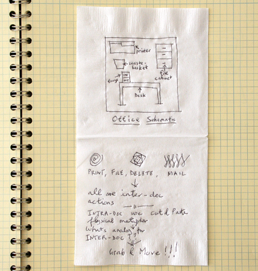
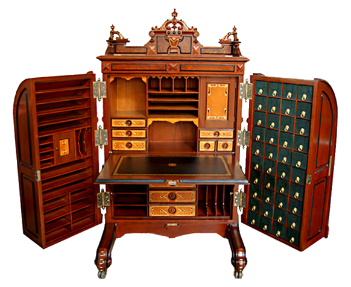
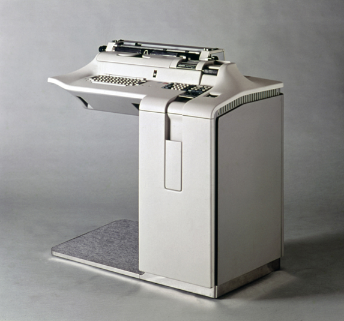

> « Propst was among the first designers to argue that office work was mental work and that mental effort was tied to environmental enhancement of one’s physical capabilities. To change a desk, then, was to change one’s entire way of being in the world. As George Nelson, one of Herman Miller’s most illustrious designers, stated loftily, “The Lord never meant a man to be immobilized in one position … These are not desks and file cabinets. They are a way of life.” Office design was coming into its own. »
>
> — *Cubed: A Secret History of the Workplace*, p. 254. Version abrégée du passage [ici](https://www.wired.com/2014/04/how-offices-accidentally-became-hellish-cubicle-farms/)

Si, comme le dit la citation, changer de type bureau, c'est changer de manière d'être au monde, la variété des mobliers décrits dans [cette liste](https://en.wikipedia.org/wiki/List_of_desk_forms_and_types)

taylorisme et flux tendu

action office

invention accidentelle du cubicle

https://www.univ-montp3.fr/uoh/lelivre/partie1/les_outils_du_copiste.html

Chaise à bras

​	https://cmcep.hypotheses.org/2581#more-2581

​	https://www.persee.fr/doc/crai_0065-0536_2005_num_149_2_22888

## mobilité

écritoire = laptop

http://www.definingfrance.com/2017/01/01/the-writing-slope/

https://meublepeint.com/bargueno.htm	

https://www.persee.fr/doc/xxs_0294-1759_1984_num_3_1_1701

https://victorianweb.org/art/design/furniture/golden1.html

## wooton

wooton = ordinateur embarqué dans bureau

https://www.openculture.com/2021/03/behold-the-elaborate-writing-desks-of-18th-century-aristocrats.html

## métaphore du bureau 

pas le canvas, mais le desk = action office

## Pièce

Dynamic land = studio

jindosh

https://youtu.be/wsQiKKfKxug?t=2100

On peut faire l'histoire du bureau sous plusieurs : arts décoratifs, organisation de [l'espace de travail](https://www.theguardian.com/books/2014/jul/03/cubed-secret-history-workplace-nikil-saval-review)

N'importe quel rebord de table peut faire bureau.

Les premières interfaces graphiques pour le grand public ont inventé la métaphore du bureau, c'est-à-dire l'idée que l'utilisateur dispose d'une surface vierge sur laquelle il peut poser son travail. L'utilisateur se retrouvait ainsi face à des notions connues et concrètes (fichiers, dossiers, corbeille).

Un [article précédent](https://toutcequibouge.net/2015/05/dune-metaphore-oubliee-macintosh-et-le-lent-declin-du-bureau/) sur l'évolution des interfaces graphiques évoque surtout l'angle physique et à quel point le comportement d'un dossier est proche d'un objet réel. Par exemple, à l'origine un dossier ne pouvait pas être ouvert dans deux fenêtres différentes. Un dossier avait sa fenêtre, une fenêtre _était_ sont dossier.

## Le meuble

On peut voir la métaphore sous un autre angle : le bureau comme outil complet de travail. Les inventeurs de Xerox PARC ne pensaient pas uniquement à la surface du bureau mais à l'objet entier, avec ses tiroirs et ses pose-stylos.

La preuve dans cette photo, tirée du livre d'histoire [Designing Interactions](http://www.designinginteractions.com/chapters/1)

Cette vision était plus proche du [Wooton](https://en.wikipedia.org/wiki/Wooton_desk) du XIXe siècle que du plateau minimaliste du XXIe. Non pas une collection d'outils mais un appareil complet fournissant tout le nécessaire au travailleur.

Ce lien entre l'ordinateur et le meuble sur lequel il est posé n'était pas inédit. Il s'avère que beaucoup de terminaux des années 70 étaient encastrés dans des bureaux. Marcin Wichary a compilé une collection ici. C'était sans doute une vision familière pour les cols blancs de l'époque et elle a pu contriber à la popularisation de l'ordinateur personnel.

Loin d'être l'alliance de deux mondes étrangers (le matériel et le logiciel), la métaphore est donc une nouvelle étape dans la figure de l'employé de bureau : un travailleur assis à son poste et autonome. Pas besoin de se lever pour aller chercher une information car il a tout à portée de la main, que ce soit avec un Wooton ou un PC IBM.

https://www.getrevue.co/profile/shift-happens/issues/when-keyboards-were-desks-190598

## La pièce

On est passé de la surface du bureau au meuble entier mais on peut aller plus loin. Pour les inventeurs de Xerox, le bureau était la pièce entière. L'échelle à considérer est le "_office_", pas le "_desk_". Je ne travaille pas à mon bureau mais dans mon bureau : c'est là où je fais les cent pas, là où je collabore avec mes collègues.

Historiquement et presque poétiquement, on retourne aux origines de l'informatique, à une époque où les ordinateurs étaient tellement énormes qu'on les opérait _de l'intérieur_. Citons Harry Reid, un des mathémaciens ayant programme l'ENIAC :

> “The ENIAC itself, strangely, was a very personal computer. Now we think of a personal computer as one which you carry around with you. The ENIAC was actually one that you kind of lived inside.”collabore avec les collègues.
>
> — [Source](https://booktwo.org/notebook/living-inside-the-machine/)

C'est aussi un passage de l'individuel au collectif : on ne travaille jamais seul et il ne faut pas se focaliser sur les interactions humain-machine mais sur des interactions humain-humain permises par des machines. Concevoir des [collecticiels](https://fr.wikipedia.org/wiki/Groupware), pas des logiciels.

## L'espace (mental)

Le meilleur angle à mon avis, c'est de considérer le bureau non pas sous l'angle des fonctions qu'il remplit mais de l'espace mental qu'il permet. j'entends par là que nos pensée sont facilitées et structurées par les outils que nous utilisons et qui forment autant de prothèses cognitives. Une arborescence

http://cognitivemedium.com/tat/index.html

bureau complet. puisdivision du travail=> bureau plat sans tiroir, le travailleur n'est qu'un rouage, un mesager amène et emporte ses docs

