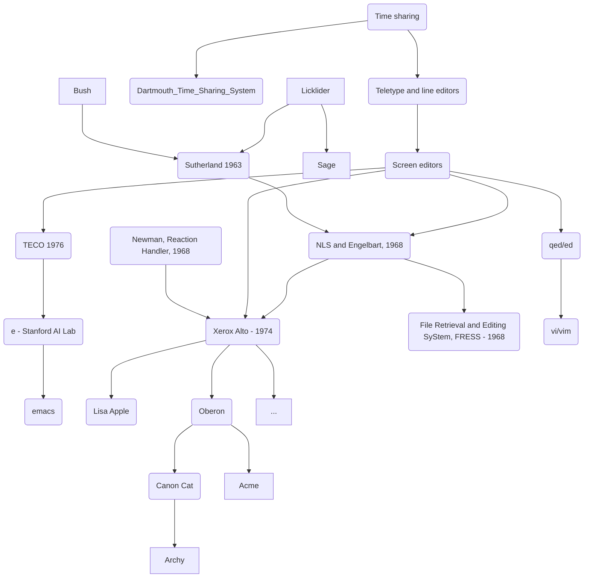

```mermaid
flowchart TB
	TS(Time sharing) ---> tty & dtss
	dtss(Dartmouth_Time_Sharing_System)
	Bush ---> Sutherland
	Licklider ---> Sage
	Licklider ---> Sutherland
	newman(Newman, Reaction Handler, 1968) ---> alto
	Sutherland(Sutherland 1963) ---> NLS
	tty(Teletype and line editors) ---> B
  B(Screen editors) --->  NLS(NLS and Engelbart, 1968) & alto(Xerox Alto - 1974) & TECO(TECO) & ed(qed/ed)
  TECO(TECO 1976) ---> e(e - Stanford AI Lab)
  NLS ---> FRESS(File Retrieval and Editing SyStem, FRESS - 1968)
  NLS ---> alto
  ed ---> D(vi/vim)
	e---> emacs
  emacs(emacs) 
  alto ---> Apple(Lisa Apple) & F(Oberon) & ...
  F ---> G(Canon Cat) & Acme
  G ---> Archy
    

```

##### 