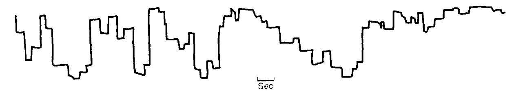

Voici le résultat de quelques recherches et réflexions sur la question du texte justifié, car beaucoup de ressources en ligne à ce sujet sont très datées. En résumé : oui il faut continuer à ferrer à gauche le texte de labeur mais la question mérite d'être posée et mieux étudiée, surtout avec le support de la césure automatique sur les navigateurs. Retours et critiques bienvenus.

## Peu d'études

Il y a très peu d'études empiriques spécifiques sur ce sujet. J'ai trouvé deux papiers de Ling & Van Schaik, vieux mais intéressants ([résumés ici](https://techcomm.nz/Story?Action=View&Story_id=156)). Ils confirment que le texte aligné à gauche est plus lisible. Plus précisément :

- Le panel était composé de gens sans troubles de l'apprentissage (ou en tout cas pas plus que dans la population générale). On peut supposer que l'effet serait pire sur un panel de dyslexiques.
- Les gens préféraient spontanément le texte justifié même s'ils étaient plus efficaces mieux avec du texte ferré à gauche (question d'habitude et d'aspect "rangé", j'imagine).

Je n'ai rien trouvé de sérieux sur la dyslexie, alors que c'est le coeur du sujet (il y a peut-être d'autres *dys* concernées mais je vais me concentrer sur la dyslexie pour pas parler dans le flou). Même les articles en apparence bien documentés reprennent des recommandations tirées d'autres articles pas plus étayés, si bien qu'on tourne vite en rond : les designers invoquent des universitaires qui invoquent des guides institutionnels qui invoquent des designers.

Si j'ai loupé des ressources intéressantes, dites-le moi.

Bref les choix typographiques ont un gros effet sur la capacité de lecture des dyslexiques, mais on nage à vue : entre la taille des caractères, la longueur des lignes, l'interlignage et l'alignement, qu'est-ce qui gêne le plus ?

Plus encore, il faudrait décorréler la question de la justification dans l'absolu de celle de son implémentation, qui est très mauvaise historiquement sur le web. Il n'y a pas d'études comparant la lisibilité d'un texte ferré à gauche à celle d'un texte *correctement* justifié. Au hasard en se basant sur une page imprimée et composée manuellement par un pro sous Indesign.

## Mais au fait, pourquoi le ferrage à gauche ?

À ma connaissance, il y a deux arguments contre la justification : l'irrégularité des espaces et la difficulté à distinguer les lignes entre elles.

### 1. Espaces irrégulières

Ça fait varier la taille des espaces et donc perturbe les trajectoires oculaires. Celles-ci sont déjà rendues erratiques par la dyslexie, c'est justement un des gros symptomes. Voir [cet article](https://www.nature.com/articles/s41598-021-84945-9) passionnant.

Voici deux graphiques ([source](https://www.sciencedirect.com/science/article/abs/pii/0028393281900440)) assez parlants comparant les trajectoires d'une personne non-dyslexique (à gauche) et dyslexique (à droite). Les lignes horizontales représentent une fixation sur un point, les lignes verticales représentent des mouvements en avant ou arrière dans le texte. Le graphique du bas est beaucoup plus irrégulier, avec des retours en arrière plus fréquents.





Mentionnons aussi que la justification peut créer des lézardes/rivières (enchainement vertical de larges espaces), mais c'est surtout notable avec un colonnage réduit.

Mais ces problèmes de mise en page sont largement réduits en coupant les mots. Cette fonctionnalité de césure est maintenant supportée en français par tous les navigateurs modernes et sur tous les OS.

<iframe height="500" style="width: 100%;" scrolling="no" title="hyphens césure" src="https://codepen.io/Saint_loup/embed/preview/vYPJPEQ?default-tab=result" frameborder="no" loading="lazy" allowtransparency="true" allowfullscreen="true"></iframe>

On est d'accord que ce n'est pas parfait :

1. les espaces restent un peu irrégulières, les algorithmes "H&J" (*hyphenation & justification*) des navigateurs restant plus basiques que ceux des deux stars du domaine (InDesign et Latex).

2. La césure elle même est problématique. Elle complexifie la lecture et peut être gênante dans des contextes de basse vision ([source](https://w3c.github.io/low-vision-a11y-tf/requirements.html#hyphenation)).

Il est probable que les évolutions techniques réduisent le premier problème :

- [Une spécification](https://generatedcontent.org/post/44751461516/finer-grained-control-of-hyphenation-with-css4) est à l'étude pour ajouter des paramètres CSS supplémentaires, semblables aux paramètres manuels que l'on trouve dans inDesign.
- Des [expérimentations existent](https://vimeo.com/330954099) avec les polices variables pour jouer sur un critère supplémentaire : la largeur des caractères. On arrive à des variations d'espaces très faibles, tandis que l'ajustement des caractères est à peine remarquable.  Le passage essentiel de la conférence est vers 20m40.
- Le créateur d'un site peut remplacer coté client l'algorithme du navigateur [par un autre](https://github.com/mnater/Hyphenopoly).

## 2. Le dentelage comme indice visuel

Second argument contre la justification : l'aspect "dentelé" des fins de ligne permet au lecteur de se repérer. Chaque petite différence de longueur constitue autant d'indices visuels pour enchainer les lignes sans se tromper ou hésiter.

Intuitivement ça me parait un bon argument. Cette fois-ci, ce n'est pas un problème d'implémentation ou de compromis, c'est inhérent à l'effet visuel.

J'aimerais juste avoir plus de détails : ce n'est pas un argument cité souvent, à quel point est-il avéré et compris ? Encore une fois, on nage à vue.

## Résumé

On continue à aligner le texte par défaut – et on continuera, tant qu'il n'y aura pas de grosse évolution technique et qu'il n'y aura pas de preuve béton que la justification ne crée aucun problème.

Cela n'empêche pas de proposer aux lecteurs une option pour changer de style et activer la justification.

Cela n'empêche pas non plus de continuer à expérimenter. Les limites web et des livres électroniques en matière de typographie par rapport à l'édition ne sont pas inéluctables.

Note sur le RGAA : il y a juste un critère AAA ([1.4.8](https://accessibilite.numerique.gouv.fr/ressources/criteres-aaa/)) (non obligatoire donc) qui oblige à avoir le texte à gauche par défaut ou via option.

## Bibliographie


