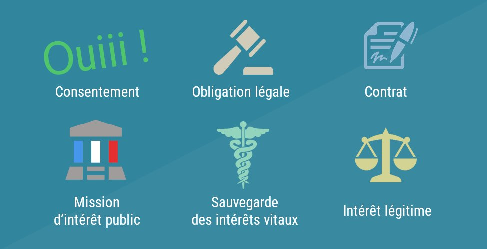
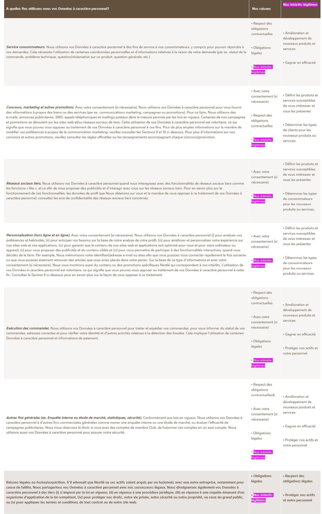
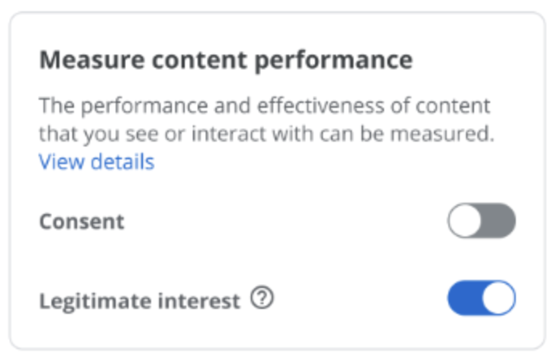
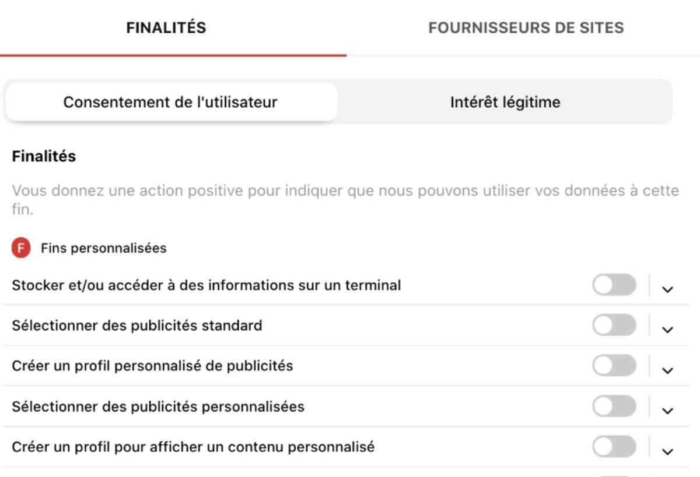
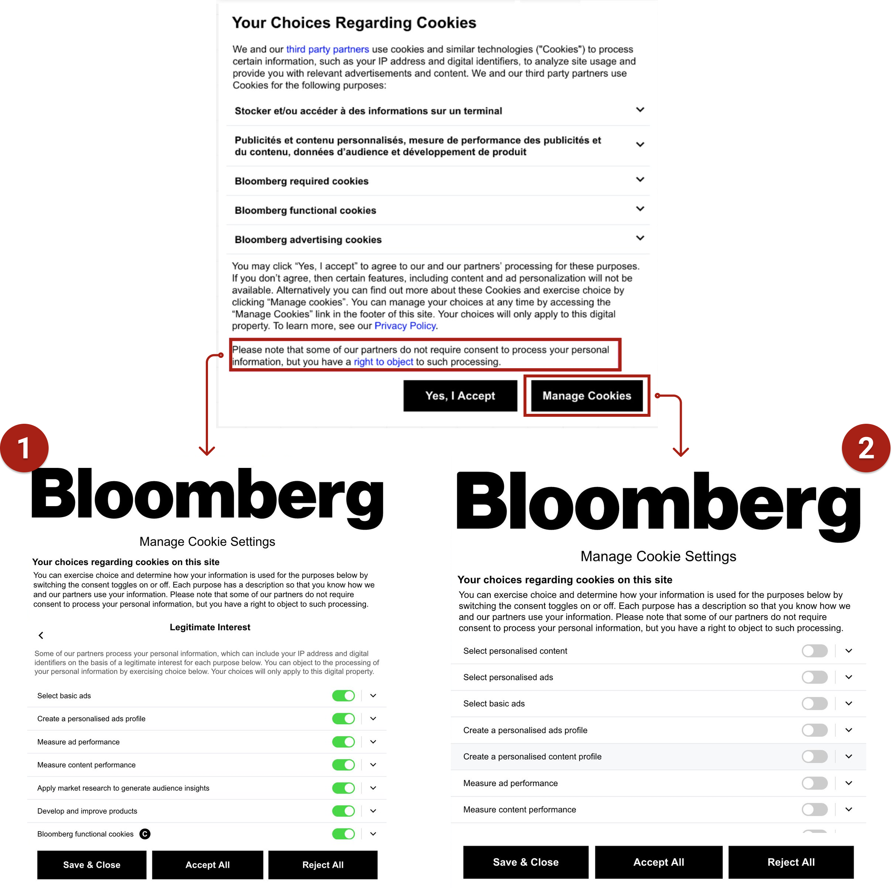

Pour recueillir une info personnelle auprès d'un particulier, il faut une raison. Vous pouvez le faire parce que vous avez son accord, parce que la loi vous y oblige, parce qu'elle est nécessaire pour lui fournir un service (pour lui livrer un produit vous avez besoin de son adresse)... Ces raisons sont au nombre de six, ce sont des *bases légales*, bien expliquées [ici par la CNIL](https://www.cnil.fr/fr/les-bases-legales).

Il y a une base légale un peu particulière, c'est l'*intérêt légitime*.https://www.cnil.fr/fr/les-bases-legales)

En gros, si une entreprise a un objectif commercial dont elle peut justifier le caractère précis et licite, que pour accomplir cet objectif elle a besoin d'une information, que  ce besoin est proportionné et nécessaire (c'est-à-dire qu'elle ne peut pas faire autrement), alors elle peut recueillir cette information sans demander le consentement de l'utilisateur.

[Détails ici, encore chez la CNIL](https://www.cnil.fr/fr/linteret-legitime-comment-fonder-un-traitement-sur-cette-base-legale)

C'est un raisonnement utilisé dans les politiques de confidentialité d'un nombre important et, dirait-on, croissant de sites web. Je ne sais pas si les juristes attendaient d'y voir plus plus clair, mais j'ai l'impression que c'était un recours beaucoup moins fréquent juste après la mise en place du RGPD.

Par exemple chez [Nestle Belgique](https://web.archive.org/web/20210117130247/https://www.nestle.be/fr/info/yourdata), c'est une base légale invoquée dans chacune des lignes du tableau. La dernière colonne apporte quelques détails : "gagner en efficacité", déterminer les types de consommateurs pour les nouveaux produits et services", etc. Ce sont des choses banales et je ne vois pas ce qui justifie une base légale exceptionnelle.

    

    

    

##  Si seulement il y avait un moyen de rendre les notices de cookie encore plus imbuvables...

Première complication : il faut croiser cette base légale avec le principe  d'opposition : le visiteur peut quand même s'opposer à cette récolte. Certains  sites incluent même une case à cocher pour ça, sélectionnée par défaut. C'est tordu : l'intérêt légitime devient dans une  espèce de consentement dédoublé, mais en opt-out et plus ou moins  planqué. Dans les deux exemples ci-dessous, il est demandé pour chaque info si on consent au recueil ET si on s'y oppose. Bref, deux fois la même question, sous un angle techniquement différent.





C'est une conception totalement scolaire du droit où on  imbrique chaque pièce sans souci de la logique d'ensemble, pour aboutir à une usine à gaz. On pourrait presque croire que c'est une forme de grève du zèle pour rendre ce genre de popin encore plus imbuvable.

## Un bien sombre motif

Ces techniques peuvent passer du byzantin au total *dark pattern* . Par exemple chez [Bloomberg](https://www.bloomberg.com/europe) vous avez deux choix si vous voulez refuser certains partages de données :

- Vue 2: Cliquer sur le bouton  "*manage cookies*", arriver sur une liste et tout refuser.

- Vue 1 : Cliquer sur le minuscule lien "*right to object*" dans le dernier paragraphe et arriver sur une  liste d'infos quasi-identiques, cette fois cochées par défaut.

Donc on peut tout refuser, au titre du  consentement, sans savoir si ça décoche les cases pour l'intérêt légitime, planquées derrière le lien. On suppose que non. D'ailleurs,  la vue 1 a un bouton retour mais pas la vue 2 : si on a refusé certaines choses on ne peut pas aller voir la vue 1 pour voir si son choix a été respecté.

 {.container-wide}

## Une pratique de toute façon pas légale

On ne contourne pas le RGPD si facilement. Tout bêtement :

> Les bases légales ne peuvent être cumulées pour une même finalité. Un même traitement de données peut poursuivre plusieurs finalités, c’est-à-dire plusieurs objectifs, et une base légale devra alors être définie pour chacune d'elles.
>
> -- [source](https://www.cnil.fr/fr/prendre-en-compte-les-bases-legales-dans-limplementation-technique)

Une même donnée peut servir à plusieurs objectifs,  mais chaque objectif doit être justifié légalement de manière distincte et spécifique. Donc tous les exemples de finasserie montrés sont de toute façon illicites. Notez que la confusion entretenue entre consentement et intérêt légitime fut un des motifs retenus par le conseil d'état pour [coller 50M€ d'amende à Google](https://www.legifrance.gouv.fr/cnil/id/CNILTEXT000038032552/).
