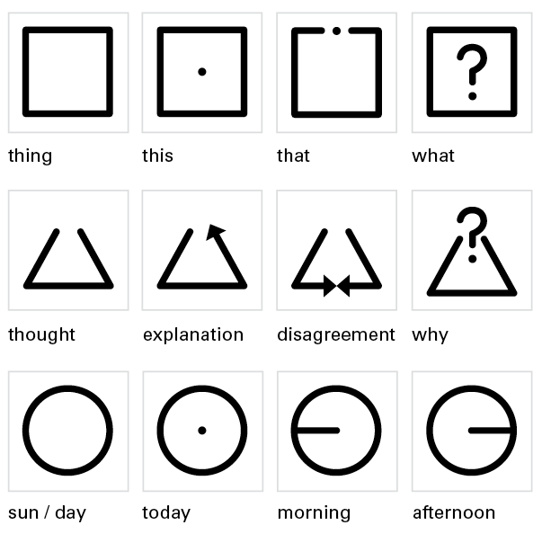
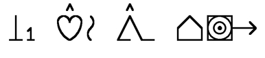
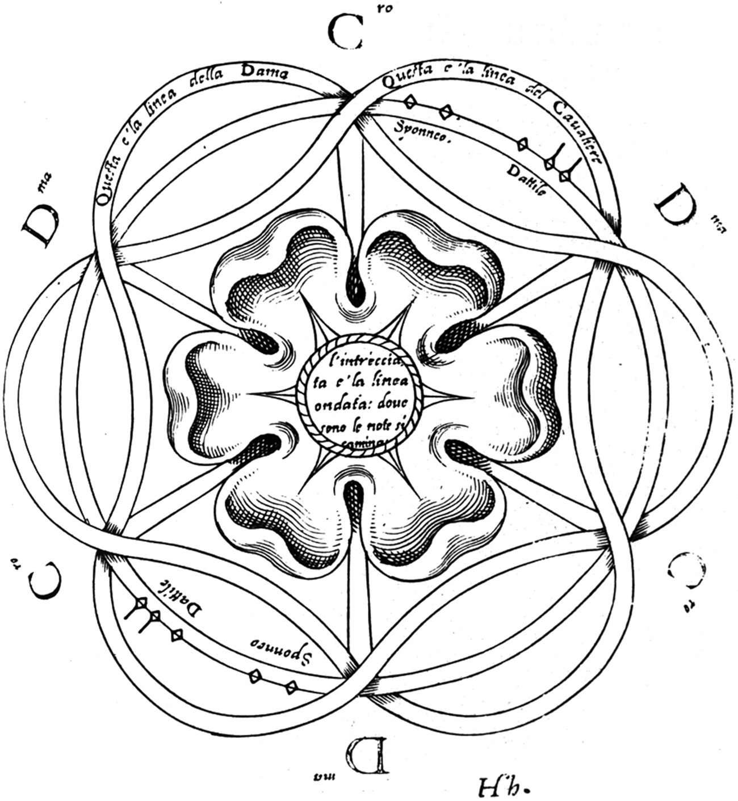
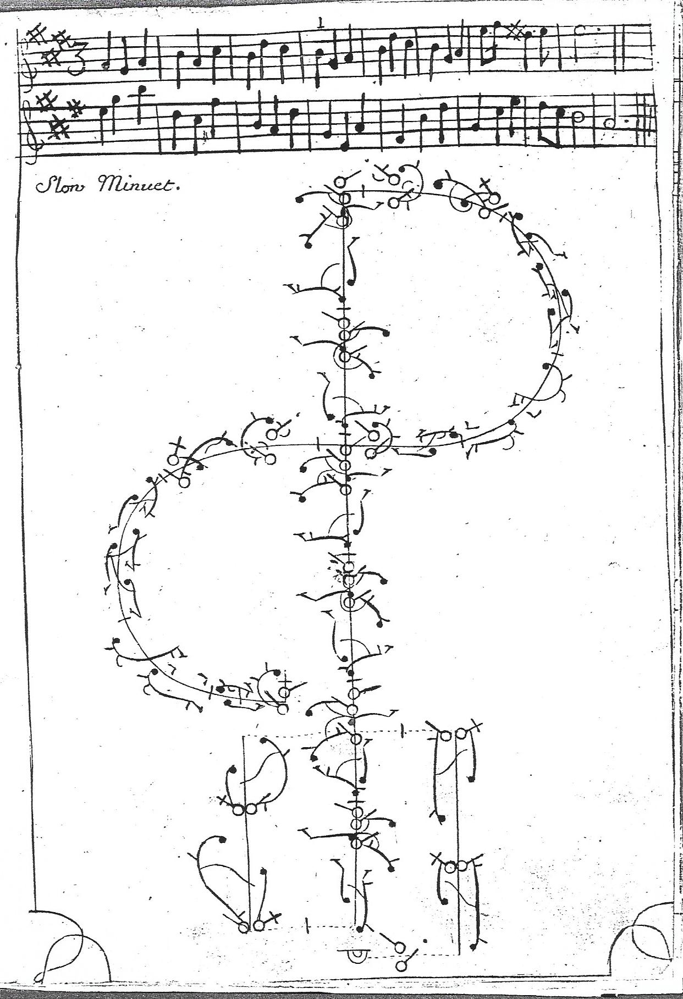
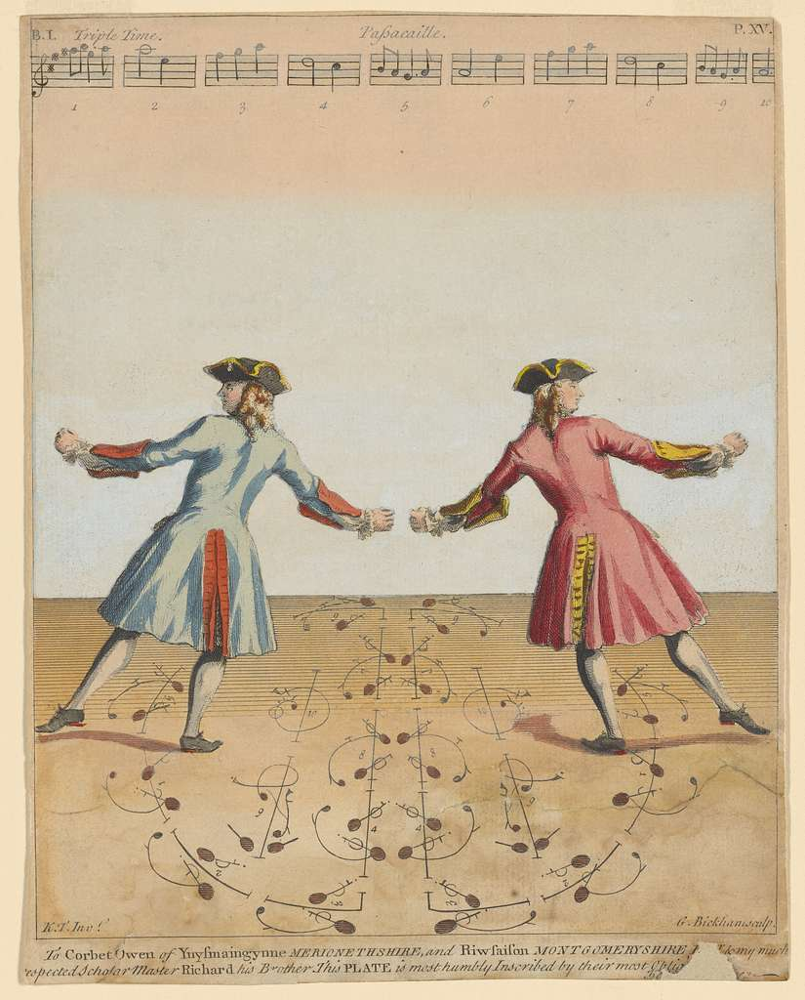
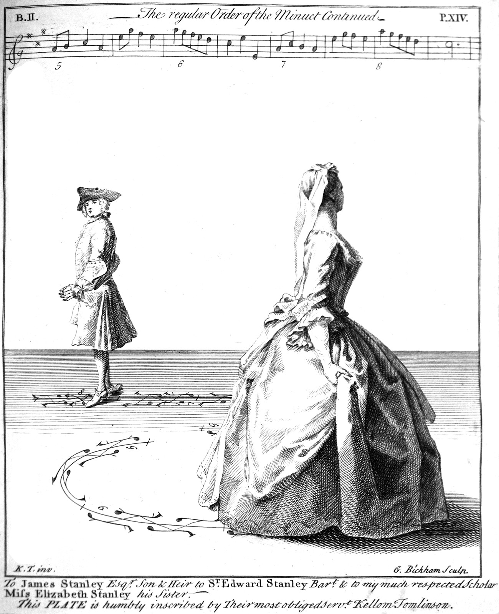
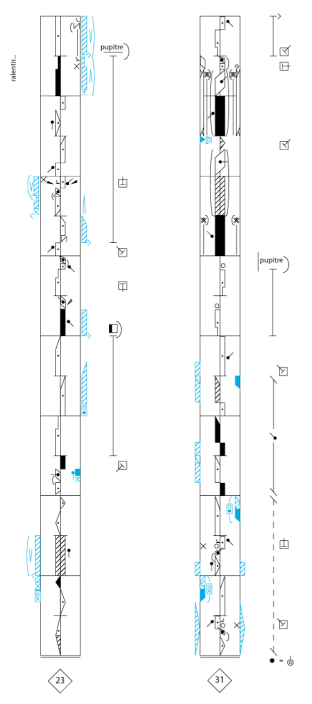
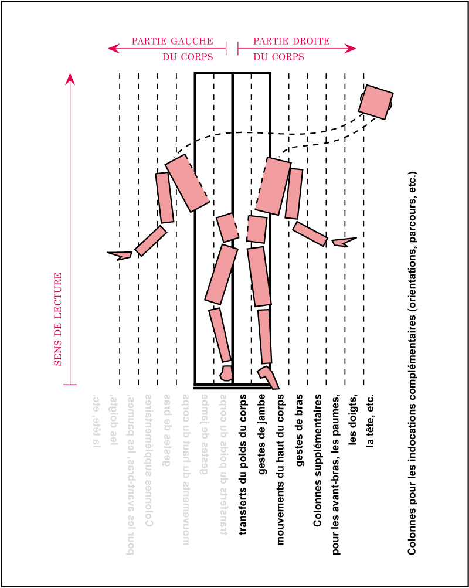
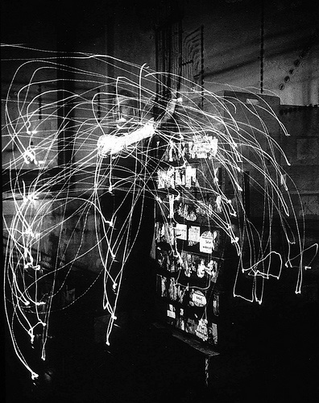
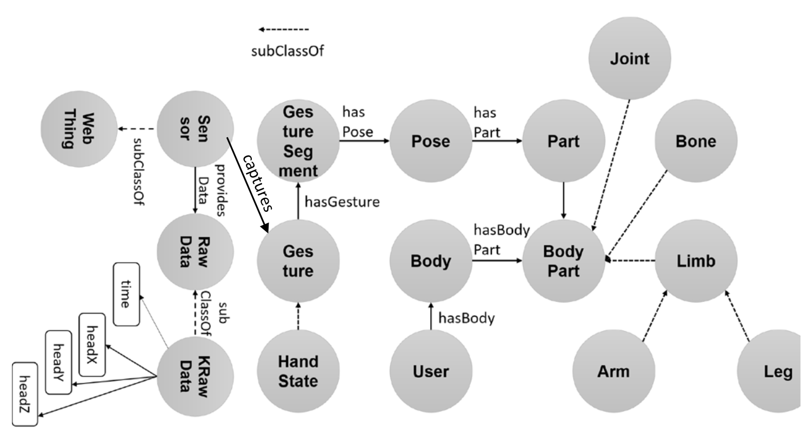

Une marotte des philosophes et autres théoriciens, c'est d'inventer un langage parfait et universel. Puisqu'il est doit être parfait, ce language s'abstrait souvent des écritures courantes et invente son propre système graphique.

Il y a le LoCos inventé par Yukio Ota, l'Isotype de Neurath, la sémantographie de Bliss… J'avais fait un petit [fil à ce sujet](https://twitter.com/Saint_loup/status/1274720385028800513).





## De la danse…

Il y a aussi des langages pas universels et dédiés au mouvement. L'idée est beaucoup plus utilisée pour la danse. Dès le 17e siècle, on trouve des premiers systèmes basiques.

Au 18e siècle, la danse baroque d'inspiration française est une part importante de la vie sociale dans les cours européennes et plusieurs systèmes de notation apparaissent et deviennent populaires. Ils se font concurrence et cela va jusqu'au procès. Les plus connus sont ceux de Feuillet en France puis Tomlinson en Angleterre. Il semble que ces systèmes n'avaient pas qu'un simple rôle de transcription. Etant donné leur popularité, ils influencent aussi les tendances. Leurs limites (notamment pour encoder autre chose que le mouvement des pieds) deviennent la limite des mouvements dansés.

Pour en savoir plus, on lira cette [page Wikipedia](https://fr.wikipedia.org/wiki/Notation_du_mouvement) [cet article](https://www.journals.uchicago.edu/doi/full/10.1086/693783). Tufte y consacre aussi une page dans son célèbtre [*Envisioning Information*](https://www.labster8.net/wp-content/uploads/2013/11/tufte-Esc-Flatland.pdf) (PDF, p. 27).





Au 20e siècle apparaissent des systèmes beaucoup plus complets. Il semble que les principaux soient la cinétographie de Laban et la choréologie de Benesh.





## … À l'industrie

Au début du 20e, l'idée de codifier le mouvement est appliquée à un tout autre domaine : l'organisation scientifique du travail. Les [époux Gilbreth](https://en.wikipedia.org/wiki/Lillian_Moller_Gilbreth) créent un les [therbligs](https://en.wikipedia.org/wiki/Therblig), une liste de 18 symboles pour décrire tous les actions effectués par un ouvrier. L'idée n'est pas d'encoder toute la subtilité des mouvements mais plutôt de normaliser et synthétiser les actions élémentaires que doit réaliser un ouvrier sur son environnement, dans une optique d'amélioration de la productivité. Un pur produit du taylorisme.

Fidèle à l'esprit scientifique de l'époque, les Gilbreth ont une approche empirique, notamment en enregistrant les mouvements de travailleurs. Ils baptisent "[chrono-cyclographes](https://medium.com/@s.cho/1910-1924-910693509313)" ces photos à exposition longue où des petites lampes sont attachés aux membres.

Notons que l'influence des méthodes des Gilbreth se fait encore sentir aujourd'hui en facteur humain et en ergonomie, notamment dans l'usage de diagramme pour [l'analyse de l'activité](https://flconsultants.fr/lean-manufacturing/diagramme-gilbreth/).

## Et au-delà ?

On trouve quelques travaux récents, notamment pour faciliter la conception d'interfaces de reconnaissance gestuelle.

- [Une taxonomie des mouvements de main en 3D](https://www.sciencedirect.com/science/article/abs/pii/S0169814113001285)
- [Une ontologie (un système formel et compréhensible par un programme) pour les mouvements](https://dl.acm.org/doi/10.1145/3319499.3328238)

