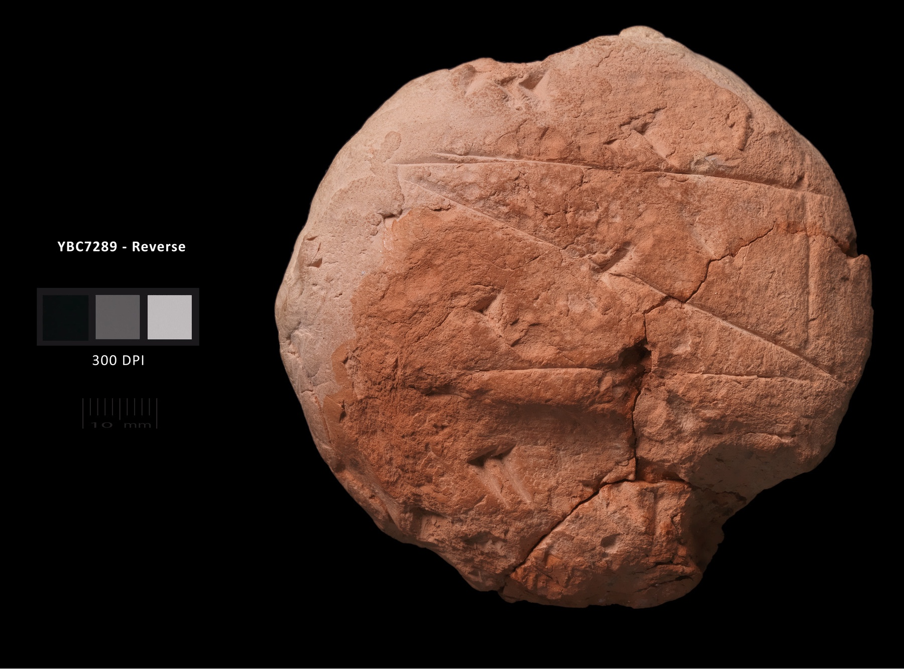
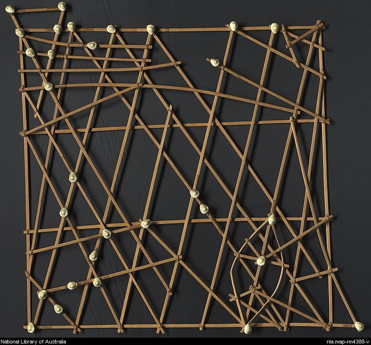
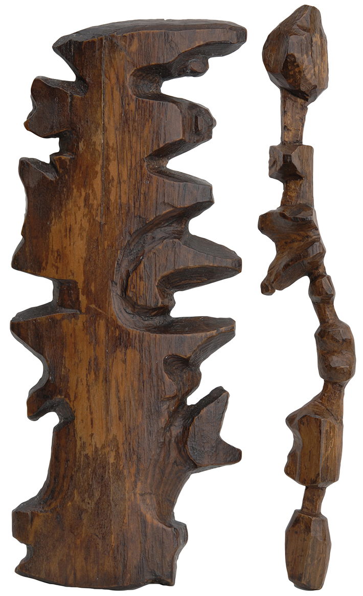
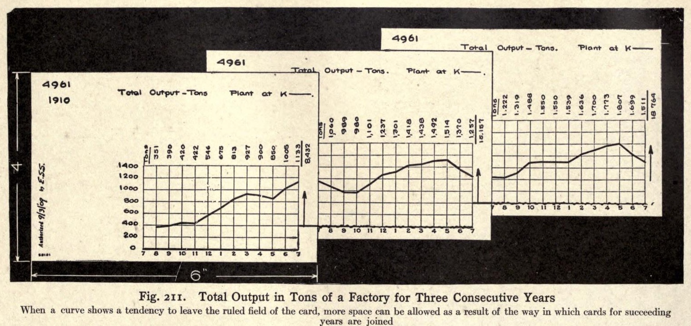
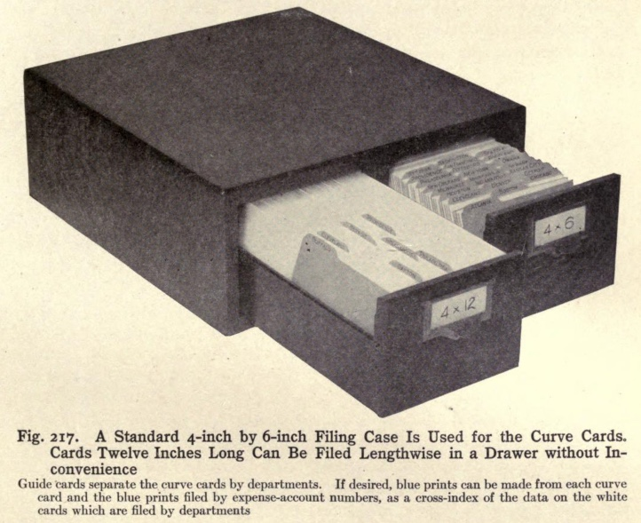

Panorama foutraque de ce que l'on appelle parfois la physicalisation de données : visualiser des données par un support physique non-numérique.

<!-- excerpt -->

## La dataviz en 3000 avant JC

On n'a pas attendu l'informatique pour représenter des données. Les [premières traces](https://en.wikipedia.org/wiki/History_of_writing#Recorded_history) de l'écriture c'est un peu ça : un jeton pour une vache, un deuxième pour une seconde vache.  Les systèmes graphiques plus aboutis étaient utilisées avec des buts similaires, puisqu'on retrouve beaucoup d'inscription parlant de taille de troupeaux, d'aire de parcelles ou de volumes de récoltes. Parfois en utilisant à plein la spatialité de la surface, comme en témoignent ces deux tablettes babyloniennes :  un problème de géométrie et le plan d'un grand bâtiment.



")





.")



Ces exemples sont impresionnants parce qu'anciens, mais vous allez dire qu'ils restent assez classiques. Voici un autre spécimen qu'on cite souvent : les cartes utilisées par les marins des îles Marshall, dans l'océan Pacifique. Les îles y sont représentées notamment par des coquillages (en blanc) et les trajectoires aidées par la houle par les tiges. Chaque carte était idiosyncrasique dans la manière dont il fallait l'interpréter et surtout utilisée par son créateur.

Citons aussi les [cartes tactiles des Inuits](https://www.archaeology.org/issues/337-1905/features/7550-maps-greenland-wooden-inuit-maps), sculptées dans du bois. Celle de gauche est une carte côtière et celle de droite représente une succession d'îles. Elle étaient apparemment plus utilisées comme support de récit qu'aide à la navigation.

 

Il y a plein de manières compréhensibles et mémorables d'encoder des informations dans des objets. Voici [une longue compilation](http://dataphys.org/list/) de ces "visualisations physiques de données", avec aussi pas mal d'expérimentations récentes. Sans rentrer dans un débat théorique ou une quête de définition, l'idée est en gros de ne pas utiliser l'écriture, ou de manière plus secondaire et auxiliaire.

## 3D

Si on saute aux XIX et XXe siècles, la création de modèles en relief est un cas d'utilisation relativement fréquent.  En 1874, Maxwell illustra avec un modèle en plâtre les liens entre l'évolution de trois variable : volume, entropie et énergie.

. Voir [Wikipedia](https://en.wikipedia.org/wiki/Maxwell's_thermodynamic_surface) pour des photos du modèle en plâtre et d'autres infos.")

Datant de 1913, cette carte montre le nombre de passagers transportés par le métro de Frankfort. La quantité était représenté par le nombre de lamelles de bois collées et empilées.

")

Datant des années 50, cette courbe montre l'évolution de la consommation d'électricité en Grande-Bretagne, suivant les heures de la journée, entre 1951 et 1954. Chaque jour est représenté par une feuille de carton et des poignées permettaient d'élargir le dispositif pour ajouter des feuilles.

.")

## Interactivité

Au début du XXe, le volume de données produites explose. Comment les récupérer, les manipuler et les visualiser facilement ?

Par exemple, comment présenter un enchainement de graphiques à un auditoire, quand on n'a même pas de rétroprojecteur ? C'est pas compliqué : créer une véritable bibliothèque de diapositives sous la forme de grands panneaux de bois imprimés et montés sur rail. J'en ai [déjà parlé ici](https://toutcequibouge.net/blog/2016/02/les-ancetres-d-excel-et-de-powerpoint/#powerpoint).





Autre exemple : [ce système de fiches](https://gravyanecdote.com/uncategorized/interactive-dashboards-in-1914-yes/) décrit dans un traité de 1914 (!) : *Graphic methods for presenting facts*. L'idée était d'utiliser plusieurs fiches représentant des graphiques et les mettre bout à bout horizontalement ou verticalement, pour comparer ou enchainer plusieurs années. Parler de "dashboard interactif", comme le fait l'article en lien, est sans doute exagéré,  mais pour l'époque l'idée apportait sans doute un grand confort. Avoir des masses de données bien organisées, prêtes à l'emploi et lisibles  facilite grandement l'analyse et la discussion, c'est un premier degré d'interactivité entre l'utilisateur et le système.

D'autant que le système était pensé de bout en bout. Il y avait des "méta-fiches" pour indexer le contenu et le retrouver facilement, la partie gauche était laissée vide si l'utilisateur voulait ajouter une annotation et chaque fiche avait un bleu (*blueprint*) pour la dupliquer et la partager facilement.





## Ouvroir de dataviz potentielles

Finissons par un exercice sous contraintes intéressant : des "photoviz" qui utilisent des objets triviaux pour figurer des quantités et liés au thème de la donnée représentée. Garanti sans triche ni redimensionnement.

https://twitter.com/JulesGrandin/status/1163371189487722496

https://twitter.com/JulesGrandin/status/1164093612172427264

## Récap des principaux liens

- [Un panorama complet de la question](https://hal.archives-ouvertes.fr/hal-02113248v1) : histoire, enjeux, développements récents...
- [Un inventaire de dataphys](http://dataphys.org/list/).
- [Plein de posts dédié à Brinton](https://gravyanecdote.com/tag/100yrsofbrinton/), auteur du traité de 1914 évoqué et qui avait à l'époque déjà recensé pas mal d'exemples.