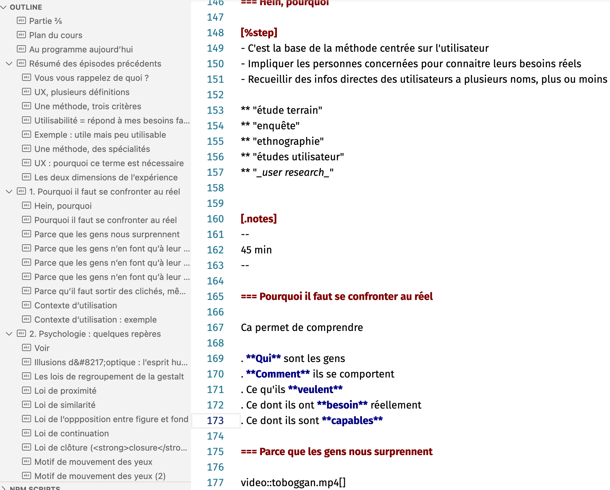

Un retour sur mon expérience d'écrire un gros support de cours avec Reveal.js/Asciidoc et dans un éditeur de texte. Ainsi que sur le petit [kit de démarrage](https://github.com/baptiste-roullin/boilerplate-asciidoc-revealjs) que j'en ai tiré.

<!-- excerpt -->

Récemment, j'ai donné un cours d'introduction au design UX. La question des diapos s'est tout de suite posée : rédiger et mettre en forme des dizaines de slides, importer texte et images de précédents supports... Même avec un template, c'est fastidieux. Et justement, je n'en avais pas sous la main.

J'ai donc pensé à [Reveal.js](https://revealjs.com/), une bibliothèque permettant de générer des slides en HTML.  Vous voyez la grande bannière sur leur page d'accueil ? Elle est interactive, c'est un exemple de slides.

 L'intérêt de Reveal.js ?

- C'est du web : le résultat est un fichier HTML léger et lisible n'importe où. Pas de risques d'être prisonnier d'un format ou d'un logiciel particulier. Le code généré est potentiellement accessible à un lecteur d'écran (plus qu'un Google Slide en tout cas). La boite spécialisée Acess42 utilise un [système comparable](https://github.com/access42/AccesSlide) pour ses présentations.
- Des transitions classes entres slides, sans ressembler à un [Prezi circa 2010](https://prezi.com/x7gjmhdpi52t/some-bad-prezis/).
- Une métaphore spatiale intéressante pour structurer le cours : on peut créer des groupes de slides qui vont défiler verticalement.
- Avec quelques plugins, une navigation puissante : table des matière automatique, recherche dans le texte, ou mode panorama.






Problème : la rédaction reste très verbeuse. On doit écrire dans le fichier HTML directement et même en tirant parti du support de Markdown on se retrouve vite avec ce genre de charabia [^1] :

```html
    <section data-markdown>
      <script type="text/template">
        - Item de liste qui va apparaitre d'abord <!-- .element: class="fragment" data-fragment-index="2" -->
        - Item de liste qui va apparaitre ensuite <!-- .element: class="fragment" data-fragment-index="1" -->
      </script>
    </section>
    <section data-markdown>
      <script type="text/template">
      <!-- .slide: data-background="#ff0000" -->
        ## Tralala pouet pouet
        [Ceci est un lien](https://p.eertu.be/w/ebe5cf34-b30b-414f-90f6-789adb859d75)
      </script>
    </section>
```


Arrive Asciidoc. C'est un format un peu plus ancien que Markdown, et aussi un peu plus riche (donc complexe). [Une extension](https://docs.asciidoctor.org/reveal.js-converter/) permet de générer une présentation complète à partir d'un fichier. L'avantage est d'écrire dans un éditeur de texte, sans se soucier de mise en forme ni de détails techniques. Dans VS Code ça donne quelque chose ça :




Chaque titre est un slide. La hiérarchie de titres, signifiée par le nombre de `=`, permet de générer la table des matières à gauche et aussi de créer les rubriques "verticales" mentionnées plus haut. Globalement, c'est assez génial pour réfléchir à l'enchainement des idées et déplacer rapidement du contenu d'un endroit à l'autre.

Pour autant, après avoir écrit 375 diapos avec, est-ce que je recommande le machin ? Ca dépend pour qui. Si vous trouvez déjà Markdown compliqué ou que vous n'aimez pas bricoler avec plusieurs outils interconnectés, fuyez. Ou bien utiliser [l'éditeur](https://slides.com/) graphique vendu par le créateur de reveal.js.

Mais si vous êtes plus éditeur de texte que Powerpoint, plus texte qu'image, que l'idée d'ajuster le placement de dizaines de blocs vous hérisse et que vous aimez les slides minimalistes, testez donc.

Réinsistons sur les avantages de la portabilité :

- Mes supports sont présentement une simple page en ligne.
- J'ai pu les réviser sur mon téléphone.
- Exporter trois slides de consigne en une seule page imprimable m'a littéralement pris quelques clics.

Mais il faut aussi détailler certains  inconvénients :

- Il  y a une courbe d'apprentissage assez raide, que j'ai tenté d'alléger avec [ce kit](https://github.com/baptiste-roullin/boilerplate-asciidoc-revealjs).
- Même avec un bon outillage, ce n'est pas du WYSIWYG. On n'est jamais à l'abri de faire une erreur de syntaxe.
- Des mises en page qui prendraient deux secondes dans un logiciel classique peuvent se révéler compliquées. Il faut ajouter quelques classes au slide pour servir de "hook" (cf. [cet exemple](https://docs.asciidoctor.org/reveal.js-converter/latest/converter/syntax/layout/#columns-layout)),  écrire du CSS et  le rendre adaptable à du texte et des images de taille différentes. Le lien précédent montre quelques possibilités prédéfinies, mais elles restent limitées. J'imagine que créer un thème complet peut être un investissement rentable si on est un conférencier régulier.
- À long terme c'est pratique d'avoir toutes les médias dans un dossier, mais en attendant, intégrer une image à un slide est fastidieux puisque il faut l'enregistrer dans le bon dossier, insérez la balise `image::nomDeFichier[]`, sans se tromper de nom. Alors qu'avec Powerpoint/Keynote/Slides je copie l'image dans le presse-papier et la colle dans le slide, sans jamais gérer de fichier. Mais [un peu d'outillage](https://github.com/baptiste-roullin/boilerplate-asciidoc-revealjs#snippets) améliore la situation.


[^1]: On peut écrire le markdown dans un fichier à part, mais il faut un fichier par slide, c'est impraticable.


<link href="https://unpkg.com/prismjs@1.20.0/themes/prism-okaidia.css" rel="stylesheet">