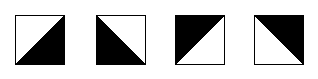
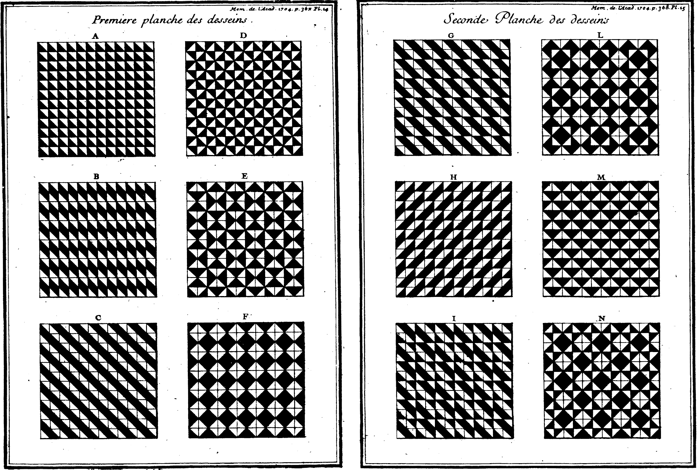
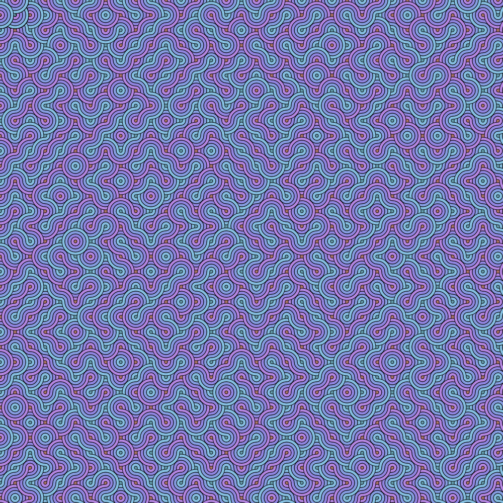
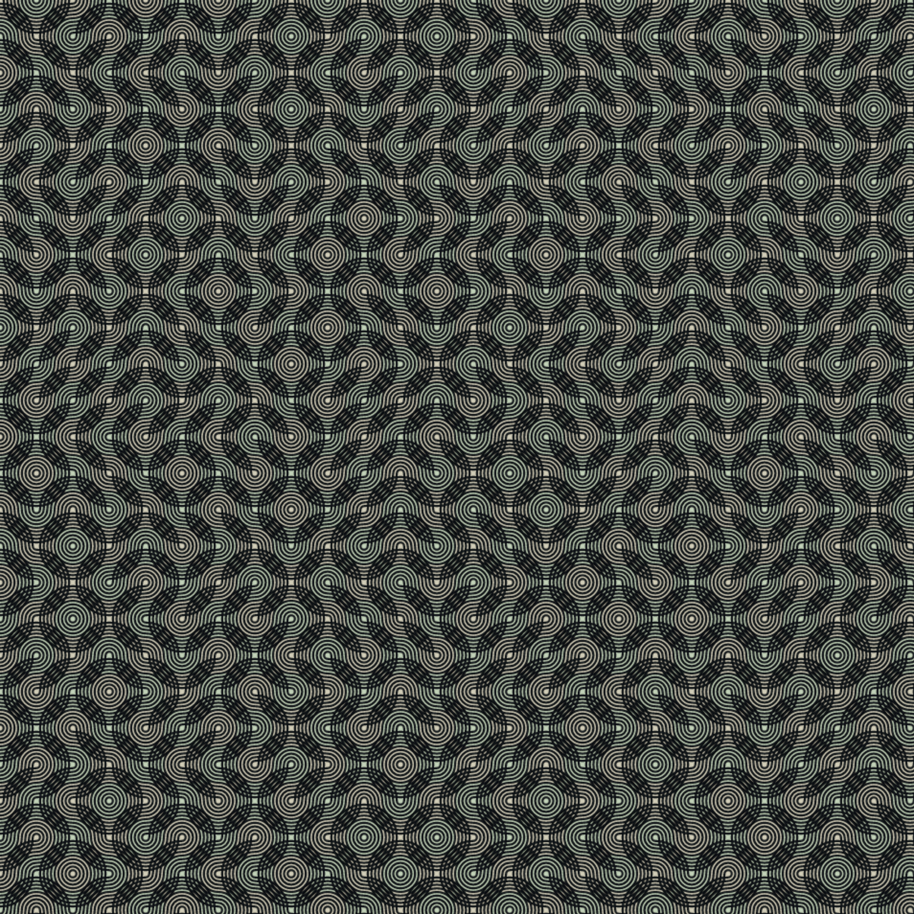

Quand un post comprend une jolie image, je la spécifie comme "mise en avant" et elle se retrouve en vignette dans la [page de liste](/blog). Que faire quand il n'y a pas d'image ? Laisser un vide ou avoir une image par défaut, toujours la même, ne serait pas très élégant. Pour obtenir des images variées mais avec une unité de style,  la génération procédurale est l'approche parfaite. Elle permet de générer des formes en alliant une trame de base et des paramètres aléatoires. On va l'appliquer à une technique bien connue en histoire de l'art : le pavage d'un espace en le remplissant avec des carreaux de base.

Ici on utilise des motifs dits de Truchet, du nom du savant éponyme : [Sébastien Truchet](https://fr.wikipedia.org/wiki/S%C3%A9bastien_Truchet), ingénieur hydraulique, mathématicien, typographe... Rien que ça. Il est notamment à l'origine des eaux de Versaille, du premier point typographique et de Times News Roman, au moins partiellement et indirectement.

## L'idée d'origine

Revenons à notre pavage. Chez Truchet, il y avait quatre carreaux de base :

Comme on le voit, c'est une variation toute bête autour d'un simple triangle. Mais avec ça, il obtenait déjà des formes variées, en les regroupant en bandes, en losange, ou en alternant noirs et blancs.

## Chez bibi

Je reprends une idée de [Cyril Harvey Smith](https://en.wikipedia.org/wiki/Truchet_tiles#Quarter-circles) : uniquement deux carrés, comprenant des quarts de cercle.

 {class="m-auto text-center"}



Si on ajoute de manière concentriques plusieurs arcs de cercle et des dégradés de couleur, c'est encore plus joli.



La trouvaille pour apporter du rythme, c'est l'absence de rupture : que quelque soit l'orientation des blocs, chaque arc est connecté à un arc voisin. Le tout forme un motif de labyrinthe, alors que le placement des blocs est purement aléatoire. La seule chose qui ne l'est pas, c'est la couleur de fond qu'on devine au centre des cercles.

Essayez vous-même : **cliquez** sur un carreau pour le faire pivoter et voir que ça ne rompt pas l'enchainement.



## Autres exemples

Voici d'autres résultats très différents, obtenus uniquement en jouant sur quelques paramètres. Pour essayer vous-même, aller voir cet [outil interactif](https://observablehq.com/@xenomachina/truchet-tiles-variant-intertwined-quarter-circles). (À qui j'ai beaucoup emprunté, techniquement et visuellement). L'auteur ajoute en plus des paramètres pour délier chaque arc concentrique et ainsi créer un effet de "[tressage](twist-scramble.png)" plus ou moins échevelé, suivant à quel point on pousse les paramètres *twist* et *scramble*.





## Pour aller plus loin

Sur l'histoire des ornementations, voir cet [article](https://www.nms.ac.uk/explore-our-collections/stories/art-and-design/grammar-of-ornament/) et cette [galerie](http://www.thegrammarofornament.com/) sur le livre La Grammaire de l'ornement, cette page sur [le pavage](https://en.wikipedia.org/wiki/Tessellation) et celle-ci sur les [carreaux](https://fr.wikipedia.org/wiki/Carreau_(construction)).

Pour une analyse psychologique de notre goût pour les motifs, voir le livre [The sense of order : a study in the psychology of decorative art]( https://archive.org/details/senseoforderst00gomb/) (accessible en ligne), par le grand historien de l'art Ernst Gombrich. Résumé grossier (j'en suis seulement à l'intro) : on aime un certain compromis entre ordre et chaos, car on est cognitivement câblé pour chercher des structures dans le monde changeant qui nous entoure.

Sur les affinités naturelles entre informatique, génération procédurale et motifs, voir le livre collectif 10 [PRINT CHR$(205.5+RND(1)); : GOTO 10](https://10print.org/) (accessible en ligne). Oui c'est le titre. C'est une ligne de Basic générant un labyrinthe étonnamment semblable au motif originel de Smith plus haut.

Étant donné l'expressivité de ce genre de pavage, vous ne serez pas étonné d'apprendre que c'est un domaine d'exploration [en mathématiques](https://images.math.cnrs.fr/Du-carreau-de-Truchet-au-carreau-de-Wang-atteindre-l-atome-de-l-aperiodique-et.html). Des pavés plus complexes sont même utilisés comme modèles de calcul. Après tout, [l'informatique exotique](https://en.wikipedia.org/wiki/Unconventional_computing) est un genre en soi.

Au-delà du carré de base et du visuel du triangle, on peut utiliser bien des formes. Voici [le travail](https://www.sciencedirect.com/science/article/pii/S2666389920301124) d'un chercheur qui fait même des motifs en 3D. Voici aussi [des exemples](https://blog.peterkagey.com/2021/02/regular-truchet-tilings/) avec plus de degrés de symétrie, avec des motifs enchassés…. Et pourtant, il y a quelque chose de spécial avec le triangle : c'est le plus simple des polygones et pourtant il peut tout représenter. En image de synthèse, c'est une [brique de base](https://en.wikipedia.org/wiki/Triangle_mesh) pour tout modéliser,  au point que les polygones plus complets sont souvent convertis en triangles.

Quand on lit [l'article](toutcequibouge.net/assets/docs/smith.pdf) où Smith introduit la variante que j'utilise, on s'aperçoit qu'il en parle à peine, négligement et toute à la fin. C'est ironique, vu la popularité de cette variante. L'article est plus général, c'est une méditation sur la notion de structure visuelle : comment elle nait de la composition de formes de simples, d'alternance de fond/figure, de changements de densité. Comment l'exploration visuelle de ces structures est intrinsèquement temporelle de. Le texte est dense, parfois incompréhensible et quasi-mystique. Extraits :

> All tilings combine aspects of lines-of-progress and cyclical closures, but they differ in their relative emphasis on internal or boundary balance: pattern depends less upon the fit of any definable polygons with their immediate neighbors than upon the whole hierarchy of directions. The eye enjoys the alternating perception of boundaries that enclose or exclude or are themselves regions of which the inner structure is remembered and does not need further analysis.
>
> […]
>
> The structure of matter devolves ultimately into the intimate coexistence of something like corpuscles of nothing and atoms of something, segregating through the accidents of history to yield regions differing in density intimately interwoven on different scales. The existence of the world as well as human perception and analysis of any part of it is a matter of the angular scale of resolution and of the time necessary for making comparison between the different parts. Both the stability of material structures and human perception of them involve the tracing of directions and terminations, the formation and the finding of closed boundaries surrounding regions of substructure, that may be similar or different in the density or shape and orientation of the parts. Without such variations and without time to compare remembrances of them, nothing can be experienced.

## Détails techniques

Ce blog est statique : les pages sont crées à l'avance par un serveur Node qui tourne juste le temps de la génération, pas quand vous visitez le site. Lors de cette phase de compilation, les motifs de Truchet sont générées. Ceux de la section "[Chez Bibi](#chez-bibi)", eux, sont créés à la volée par votre navigateur. D'ailleurs ce ne sont pas des fichiers d'image mais des éléments `<canvas>`.

Dans les deux cas, le cœur du code est le même : [truchet-core.ts](https://github.com/baptiste-roullin/blog/tree/dev/src/truchet). C'est tout l'intérêt d'utiliser Javascript pour le front et le back. D'ailleurs, pour pouvoir dessiner des pixels sur un `<canvas>`, il faut l'API Canvas. De base, Node ne sait pas ce que c'est : c'est une [technologie de navigateur](https://developer.mozilla.org/en-US/docs/Web/API) dont il n'a pas besoin. De même, il ne sait pas ce qu'est un élément `` ou un click de souris. Pas grave, Canvas a été [ré-implémenté](https://www.npmjs.com/package/canvas) pour Node.

